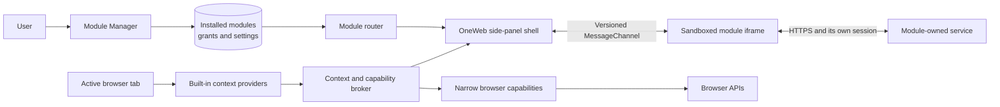
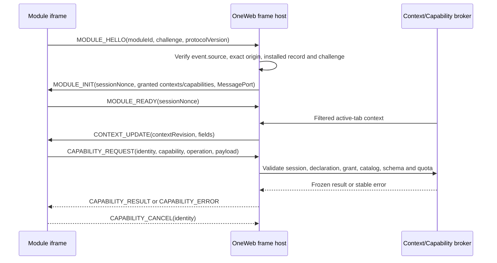

# OneWeb Module Platform Architecture

Feature-level decomposition decisions and their sequential delivery gates are tracked in
[`module-decomposition-roadmap.md`](module-decomposition-roadmap.md).

## 1. Decision summary

OneWeb should become a **host for user-installed web modules**. A module such as RepoLens is a
separately deployed web application with a small manifest and an iframe entry point. OneWeb owns
the browser integration, module lifecycle, context collection, permission review and secure
message bridge.

The first version deliberately supports only sandboxed remote UI modules. It must not download and
execute JavaScript inside the extension, dynamically inject module-provided content scripts, or
expose raw `chrome.*` / `browser.*` APIs. This keeps the design compatible with Manifest V3's
remote-code restrictions and preserves a reviewable security boundary.



## 2. Product and trust boundaries

### OneWeb owns

- Module installation, validation, enable/disable and removal.
- The side-panel shell and module switcher.
- Active-tab routing and lifecycle management.
- Context providers that understand browser or site state.
- Capability grants and narrow wrappers around privileged browser APIs.
- Protocol validation, origin checks, nonces, timeouts and rate limits.
- Local module settings that are not secrets.

### A module owns

- Its iframe UI, backend, business logic and data retention policy.
- Its own authentication session and server credentials.
- A public module manifest and compatible bridge implementation.
- Clear disclosure of the context and capabilities it requests.

### The user controls

- Which modules are installed and enabled.
- Which origins, context fields and browser capabilities each module may use.
- Whether a module can activate automatically for matching pages.
- Revocation of grants and deletion of module-local data.

## 3. Module model

A module is installed from a manifest URL. The manifest is copied into local extension storage after
validation; it is not trusted live on every panel open. The iframe entry origin is bound to the
installed record and cannot change without a new approval.

Recommended discovery path for the MVP:

1. The user opens **OneWeb → Modules → Add module**.
2. The user pastes a manifest URL, for example
   `https://repolens.example/.well-known/oneweb-module.json`.
3. OneWeb requests optional access only to that exact origin so it can fetch the manifest.
4. OneWeb validates the schema and shows an install review screen.
5. The user approves requested context fields and capabilities.
6. OneWeb stores a pinned installed record and opens the module in the side panel.

Example manifest:

```json
{
  "manifest_version": 1,
  "runtime": "remote-frame",
  "id": "dev.juck.repolens",
  "name": "RepoLens",
  "version": "0.1.0",
  "description": "GitHub repository intelligence",
  "icon_url": "https://repolens.example/oneweb/icon-128.png",
  "entry_url": "https://repolens.example/oneweb/embed",
  "matches": ["https://github.com/*/*"],
  "contexts": ["github.repository"],
  "context_fields": {
    "github.repository": ["repo", "url", "pageType"]
  },
  "capabilities": [],
  "activation": "manual",
  "min_host_version": "0.1.0",
  "bridge": {
    "protocol": "oneweb.module",
    "version": 1
  }
}
```

Manifest constraints:

- `id` is immutable and uses reverse-domain form.
- `entry_url` must use HTTPS, except `localhost` and `127.0.0.1` during explicit development mode.
- Manifest, icon and entry URLs must use the same origin; cross-origin entries are rejected.
- `matches` selects eligible tabs; it does not grant context or browser capabilities.
- `context_fields` must list at least one allowlisted field for every requested context. Installed
  field grants are stored separately and can be narrower than the manifest request.
- An update may change copy/version or reduce access without a new grant. Added match patterns,
  contexts, context fields or capabilities require approval. Identity, runtime, source/entry origin
  and bridge protocol changes are rejected rather than treated as updates.
- The installed record stores the approved manifest, source URL, timestamps and normalized grants.
  Installation review digests remain short-lived. Phase 2D-A adds nullable update metadata containing
  a validated candidate manifest and source URL, the SHA-256 digest of the normalized manifest, the
  check timestamp and its approval status.

The module server must allow its entry page to be framed by the extension, avoid
`X-Frame-Options: DENY/SAMEORIGIN`, remain usable from a narrow panel, and never assume that an
unpartitioned third-party cookie is available.

## 4. Host components

### ModuleManager

Validates manifests, requests optional permissions and persists installed records. It provides the
module-management UI and produces a human-readable permission diff for updates.

The delivery boundary is deliberately narrower at first. Phase 2A makes the background
`ModuleManager` the sole owner of registry mutations and exposes only list, enable/disable and
remove requests through a versioned extension-internal protocol. Manifest fetching, optional
permission requests and management UI remain separate later phases. Seeded modules may be disabled
but cannot be removed; only user-installed records are removable.

Phase 2B adds a sidebar management client and view without widening that protocol. Manifest copy is
inserted as text rather than HTML, requested access is shown separately from installed grants, and
user-module removal requires confirmation. Disabling the active module destroys its frame channel;
enabling it creates a new session and refreshes the active-tab context from the background.

Phase 2C adds remote installation without moving registry ownership into the sidebar. The sidebar
must synchronously request the exact manifest origin while its trusted click still has user
activation; the background then verifies that grant, fetches and validates at most 128 KiB, and
returns a review rather than persisting. Confirmation re-fetches the same URL and compares a SHA-256
digest of the normalized manifest before storing only the intersection of declared and selected
grants. Cancellation, failed confirmation and removal release the optional origin only when no
installed remote module still uses it.

Phase 2D-A defines update state without acquiring or applying an update. Its pure classifier returns
one of `safe`, `approval-required` or `rejected`. Copy/version changes, same-origin entry-path
changes and access reductions are safe. New match patterns, contexts, fields or capabilities need
approval; manual-to-suggested activation also needs approval because it widens when a module may
appear. Module ID, manifest/runtime type, candidate source origin, entry origin and bridge protocol
are immutable. A rejected candidate can be recorded for diagnostics but must never replace the
installed manifest.

Phase 2D-B1 adds only manual candidate acquisition. The background `ModuleManager` resolves the
installed record first and passes its pinned `sourceUrl` to the same loader used by Phase 2C; callers
cannot provide a replacement URL. Exact-origin permission, response-size, redirect, entry-origin,
manifest and host-version checks therefore remain identical to installation. A dedicated serialized
registry mutation stores the classified candidate or clears stale candidate state after acquisition
failure without changing the installed manifest, grants, enabled state or lifecycle timestamps.
Safe, approval-required and rejected candidates may all be retained; a rejected candidate is
diagnostic state, never executable state.

### ModuleRegistry

Reads versioned records from `browser.storage.local`, repairs them against packaged seeds and
returns defensive copies of validated records. Consumers decide whether disabled records should be
shown or activated. Suggested keys:

```text
oneweb.modules.v1
oneweb.grants.v1
oneweb.module-settings.v1.<module-id>
oneweb.module-state.v1:<module-id>
```

The Phase 2D-A record extension is deliberately nullable:

```text
update: null | {
  candidateManifest
  candidateSourceUrl
  normalizedManifestDigest
  checkedAt
  approvalStatus: not-required | pending | approved | rejected
  approvedManifestDigest: null | normalized SHA-256 digest
  approvalSnapshot: null | {
    approvedManifestDigest
    approvedMatches
    approvedActivation
    approvedContextFields
    approvedCapabilities
    approvedAt
  }
}
```

Records written before Phase 2D-A have no `update` property. Registry normalization migrates them to
`update: null` in place without changing the installed manifest, grants, `installedAt` or
`updatedAt`. Invalid or internally inconsistent candidate metadata is discarded independently so a
bad cached candidate cannot delete an otherwise valid installed module. Approval status is derived
from the current pure classification: safe candidates are `not-required`, rejected candidates are
`rejected`, and expanded-access candidates remain `pending` unless a later explicit approval flow
has set them to `approved`. An approved expanded-access candidate is valid only when
`approvedManifestDigest` equals `normalizedManifestDigest`. A different candidate manifest or
digest, or a legacy approval without that binding, resets the status to `pending` and clears the
approved digest and authorization snapshot. Only an `approval-required` candidate can carry an
approval snapshot. The snapshot binds candidate-wide match patterns and activation while storing
only the user's selected additions for context fields and capabilities; it is never populated from
all manifest declarations by default.

Phase 2D-B2 treats the stored candidate as review state rather than an application payload. It
re-fetches the pinned source URL immediately before applying under the Phase 2C/B1 acquisition
constraints, normalizes and hashes the response, and requires that digest to equal both the
persisted candidate digest and, for expanded access, `approvedManifestDigest`. The classifier runs
again on the fetched manifest. A serialized compare-and-swap mutation then atomically installs only
a safe or validly approved candidate, removes grants no longer declared, unions only the selected
approved field/capability additions, preserves `installedAt` and enabled state, advances
`updatedAt`, and clears the applied update. Any failure leaves installed state untouched.

Phase 2D-B3 adds a presentation boundary without weakening that background contract. A pure model
turns installed/candidate records into text changes, permission diffs, immutable-boundary diagnostics,
fine-grained approval choices and allowed actions. The sidebar invokes only the versioned management
client: checks remain manual, approval never applies, safe application never invents an approval, and
rejected or locally stale candidates have no executable controls. New context-field and capability
choices default to unselected. All manifest-controlled strings are inserted as text nodes. Transport
or compare-and-swap uncertainty triggers a registry-backed refresh; application-time remote
replacement additionally disables the old digest until another explicit check.

Phase 2D-B4 validates the platform boundary with two independent conformance modules served from
different origins. Both modules are ordinary remote fixtures: OneWeb sees only their standard
manifest URLs and declared access, and production code contains no fixture ID, origin, runtime or
business-logic branch. Fixture web code remains outside the extension execution environment.

Every installed record is the isolation unit. Exact-origin permission ownership, enabled state,
installed manifest and grants, candidate metadata, digest-bound approval snapshot, installation and
update timestamps, compare-and-swap identity and removal state are resolved by module ID and pinned
source URL. A check, approval, application, rejection, failed fetch, application-time replacement or
removal race for one module must neither mutate nor invalidate another module. Newly approved context
fields and capabilities are unioned only into the reviewed module; access reduction prunes only that
module's grants. Cross-module tests take a complete snapshot of the uninvolved record so accidental
shared state or broad cleanup is observable.

Phase 2D-B4 closes the Phase 2 module-platform loop. The reusable pair fixtures live only in unit and
Chromium E2E test code; their identities and origins do not occur in production source or the built
extension. Passing isolation gates cover installation, enabled state, grants, candidates, approvals,
timestamps, safe and expanded application, reduction, rejection, failed acquisition,
application-time replacement and deletion races. Phase 3 can therefore add Bookmark Doctor as the
next isolated built-in module without reopening the remote-module update boundary.

Phase 3A introduces the first packaged `builtin` without exposing bookmark data to the remote-module
path. Its manifest requests no tab contexts and declares only `bookmarks.read`; that module
capability maps to the extension manifest's optional `bookmarks` permission. The installed record is
disabled and ungranted by default. Enabling a record, granting its module capability and granting the
browser permission are separate conditions; the read boundary verifies all three before calling the
narrow bookmark-tree reader.

Bookmark Doctor accepts browser bookmark-tree nodes through a small interface and immediately
normalizes them into local pure-data entries. Normalization owns folder paths, URL eligibility,
duplicate handling and stable IDs, but performs no network request and no bookmark mutation. Scan
states and errors are data rather than thrown browser objects. Bookmark content and results use a
module-specific key derived by the generic `oneweb.module-state.v1:<module-id>` namespace helper;
they are never registered as a context, delivered through `ContextBroker`, or made available to a
remote frame.

Phase 3 remains sequential: 3A fixes contracts and the read-only skeleton; 3B is a deliberately
small manual batch-scan proof of concept; 3C adds explicitly confirmed repair operations; 3D adds
the complete UI and lifecycle isolation gate. Phase 3B is not a generic task engine and does not
pre-design pause/resume, persistence, retry, scheduling or repair workflows.

Phase 3A is complete as of 2026-08-28. The packaged seed is disabled and ungranted by default,
remote manifests cannot declare `bookmarks.read`, and the extension requests `bookmarks` only as an
optional permission. Pure normalization and narrow-reader tests cover empty, malformed, duplicate
and cyclic input, URL eligibility, stable IDs, permission failures and isolation from RepoLens plus
two user-installed modules.

Phase 3B is complete as of 2026-08-28. Its background-only coordinator holds one prepared batch and
one active run in memory. Four workers issue credential-free, no-store GET requests with an
eight-second timeout, cancel response bodies after headers and emit only reachable, HTTP error,
timeout or network failure. Results are neither stored through `ModuleLocalStateStore` nor exposed
as a generic context or capability. Stop invalidates the run token and aborts all active requests;
workers from an older run cannot append results to a newer run.

Cross-origin access uses a two-step trusted UI flow. The background first reads and normalizes the
bookmark tree, derives the finite set of exact `scheme://host[:port]/*` patterns and returns a
short-lived preparation token. A subsequent explicit user click requests only those origins before
starting; the background verifies the same token, current builtin identity, enabled state,
`bookmarks.read` grant, browser permission and exact-origin grants again. The manifest's broad
optional-host entries are only install-time ceilings. The scanner introduces no `<all_urls>` runtime
grant and no reusable arbitrary-network API.

The optional `bookmarks` grant is synchronized into the installed builtin record by a generic,
serialized Registry capability mutation. Builtin lifecycle dispatch occurs outside Registry by the
packaged `entry_id`; disabling the record or observing `permissions.onRemoved` stops the scanner
immediately. These events do not mutate RepoLens or either remote module.

The completed Phase 3B gate passes typecheck, full lint, 136 unit tests, production Chromium build
and all 11 Chromium scenarios. The real-browser fixture creates actual bookmarks for reachable,
HTTP-error, timeout and connection-failure endpoints, observes no more than four active requests,
stops a slow batch, disables an active run and compares full RepoLens plus two remote-module records
before and after. No repair behavior was pulled into the Phase 3B proof of concept before Phase 3C
introduced it behind a separate reviewed boundary.

Phase 3C is complete as of 2026-08-28. Bookmark mutation is represented by a separate
`bookmarks.write` capability reserved for packaged builtins; sharing the browser's optional
`bookmarks` permission does not merge its Registry grant with `bookmarks.read`. The host never
offers a generic bookmarks bridge. Only Bookmark Doctor's dedicated background controller can
prepare and execute update, move, ignore and single-bookmark delete operations.

Repairs use a two-step, compare-before-mutate protocol. Preparation re-reads the browser node and
creates a random, expiring, in-memory token bound to the operation, the complete mutable node
snapshot and the proposed change. Confirmation re-checks builtin identity, enabled state, read and
write grants, browser permission, expiry and token, then re-reads the node and requires an exact
snapshot match. Update allowlists title and URL, move allowlists parent and index, and delete
requires an explicit destructive confirmation value. Tokens are single-use and all outstanding
tokens are discarded on disable or bookmark-permission removal.

Ignore does not mutate browser bookmarks. It and the minimal pre-delete recovery record use only
Bookmark Doctor's `oneweb.module-state.v1:` namespace; later manual scan preparations omit ignored
bookmark IDs. The controller serializes state changes and writes a deletion backup before calling
the narrow remove operation. Confirmed batches report a
typed outcome for every item and continue after item-local failures. No repair data enters the
generic context bridge, another module's Registry record or remote-frame storage. The completed gate
passes typecheck, full lint, 152 unit tests, production Chromium build and all 12 Chromium scenarios,
including real update, move, ignore, delete, destructive-confirmation, stale-target and cross-module
isolation coverage. Phase 3D subsequently adds diagnostics, restore UX and the complete product
workflow without changing the scan engine.

Phase 3D completed on 2026-08-28 and closes the existing Bookmark Doctor feature set rather than
expanding the scan engine. The trusted management page is now a result-driven workspace: pure
presentation state filters reachable and problem results, result rows seed reviewed repair drafts,
and namespaced diagnostics list ignored bookmarks plus deletion backups. Scan results remain in
background memory and continue to use the Phase 3B limits and outcome model.

Restore is also reviewed and compare-before-mutate. A short-lived token binds the exact stored
deletion backup. Confirmation re-checks lifecycle, browser permission, backup equality, original
parent existence and an exact title/URL conflict query before using a narrow bookmark-create method.
A successful create removes only that backup. Unignore and explicit local cleanup are serialized
module-state mutations; cleanup never changes browser bookmarks or any Registry record.

Permission ownership is conservative. Preparation records which exact origins were already
granted. After a run or explicit revoke, Bookmark Doctor may remove only origins newly acquired for
that preparation, and only after re-reading installed remote modules and retaining every origin
still required by their fixed source, entry or icon URL. The revoke operation also stops work,
invalidates every token, clears both bookmark capability grants and removes the optional browser
permission. Pre-existing origins and origins shared with user modules are never treated as owned.

### Clash Control Phase 4A decision

Phase 4A is an architecture spike, not the Clash product. It compared two concrete paths against the
same localhost fixture:

1. A `remote-frame` can render a companion-owned UI, but it has no extension runtime and receives
   only the existing generic context bridge. OneWeb must not add credentials or arbitrary localhost
   fetch messages to that bridge. This shape is viable only when the separate local companion owns
   its own authentication and controller calls.
2. A packaged `builtin` connector can keep host permission checks, the authorization header, fixed
   endpoint allowlist and lifecycle cancellation in the trusted background. It must use a dedicated
   protocol that remote frames cannot invoke.

The PoC accepts only a normalized `http` or `https` origin whose host is the explicit `localhost`, an
IPv4 `127.0.0.0/8` address or IPv6 `::1`. Credentials, paths other than `/`, query strings and
fragments are rejected. The resulting exact-origin pattern is reviewed and requested before the
background contacts fixed `/version` and `/configs` endpoints with redirects disabled.

Phase 4A does not persist credentials. The trusted extension page collects a one-shot secret through
a browser modal, never assigns it to a document node, immediately transfers it over the dedicated
validated runtime message and drops its reference. The background keeps it only for the active
request and returns a sanitized status object. No secret-bearing object is written to local/session
storage, module state, logs, URLs, generic context messages or remote frames. Explicit disconnect,
disable and relevant permission removal abort work and conservatively release only connector-owned,
unshared origin access.

The working fixture, Chromium sandbox experiment and isolation gate select the packaged `builtin`
connector. [`ADR-0001`](adr/0001-clash-control-packaged-builtin.md) records the decision. Phase 4B
hardens only this dedicated path; it does not generalize the connector into a network or
secret-vault capability. Remote frames keep the existing generic context-only bridge and receive no
Clash operation, localhost fetch or credential message.

### Clash Control Phase 4B connection contract

Phase 4B separates persisted configuration from an ephemeral connection session. The only durable
connector value is a versioned profile containing a controller origin that has passed the exact
loopback normalizer. Legacy string or unversioned-origin shapes are migrated to that profile; an
invalid, remote, credential-bearing or path-bearing legacy value is discarded. Secret material,
preparation tokens, generations, diagnostics and controller responses are never profile fields and
never enter generic module state.

The background owns a pure five-state lifecycle: `disconnected`, `preparing`, `connecting`,
`connected` and `error`. Beginning a preparation advances the generation and creates a random,
short-lived token bound to that generation and the normalized origin. Connect repeats module,
permission, token, origin, generation and expiry checks before any request. Replacing a preparation
or changing lifecycle generation makes the previous token stale. Only the fixed read-only Clash
endpoints can run, and only the controller may attach the transient Authorization header.

An MV3 service-worker instance is a session boundary. Startup may read the profile but reconstructs
`disconnected`, clears a stale connector capability grant and possesses neither a secret nor a
valid preparation. It does not infer a connection from an exact-origin browser permission and does
not reconnect. A controller status returned before suspension is therefore advisory only within
that worker instance.

Lifecycle invalidation occurs before asynchronous cleanup so a late fetch, permission result or
Registry result cannot publish into a newer generation. Disconnect, disable, relevant permission
removal and authentication/protocol failure clear the in-memory session and the dedicated
`clash.status.read` grant. Connector-owned origin permission is removed only when no other owner
still uses it. Failure never writes a generic module-state value and never mutates another module's
record.

Cross-builtin permission safety uses a narrow exact-origin usage coordinator outside
`ModuleRegistry`. Each packaged controller reports whether it is actively preparing, connecting or
using a pattern, and asks whether another packaged owner uses that pattern before removal. This
makes the relationship bidirectional without teaching Registry about Clash or Bookmark Doctor.
Installed remote-module source, entry and icon origins retain the existing conservative veto.

Phase 4B completed on 2026-08-28. The implementation uses protocol version 2 and the dedicated
`oneweb.clash-control.profile.v1` storage key. Worker startup is an eager cleanup boundary rather
than a UI-triggered inference: it restores only the normalized origin, clears a stale
`clash.status.read` grant and creates a disconnected generation with no credential. A real Chromium
extension reload verifies that no automatic request occurs, the profile remains origin-only and the
user must explicitly prepare and connect again. Full isolation and secret-surface checks pass with
221 unit tests and all 13 Chromium scenarios.

### Clash Control Phase 4C read-only snapshot contract

Phase 4C completed on 2026-08-28. It adds no general request surface: the dedicated controller may
execute only the fixed authenticated `GET /version`, `GET /configs` and `GET /proxies` sequence after
an explicit user refresh. Callers cannot submit a path, URL, method, headers or request options. The
existing loopback-only exact-origin check, redirect rejection, five-second timeout and bounded
response read apply independently to every endpoint.

Each response crosses a versioned pure parsing boundary before it can become product data. The
projection retains only normalized version metadata, current mode, proxy-group name/type/current
selection and minimal node name/type/alive state. Unknown fields are dropped. Missing, mistyped,
oversized or incompatible required data yields a stable diagnostic rather than a partial raw
object; UI code receives only the normalized snapshot and renders its strings as text.

The snapshot is worker-memory session state bound to the connected origin and lifecycle generation.
Every refresh captures that binding, and only the newest refresh for the still-connected generation
may publish. Disconnect, disable, relevant permission removal, authentication/protocol failure,
worker startup or any other generation advance invalidates the snapshot before asynchronous
cleanup. A restarted worker restores at most the origin-only profile and never restores a snapshot,
credential or connection and never requests the controller automatically.

This read path remains dedicated to the packaged builtin. It does not enter Registry state, module
namespaces, the generic context bridge or a remote frame, and it does not alter the 4B shared-origin
coordination contract. Phase 4C excludes mutation APIs, latency testing, polling, automatic refresh
or reconnect and every arbitrary-path or arbitrary-URL capability.

The implementation advances the dedicated protocol to version 3 and stores a version-1 normalized
snapshot only in the current worker. A transient network failure marks an existing snapshot stale;
authentication, protocol, permission and lifecycle failures clear it with the session credential
and dedicated grant. The text-only management surface and localhost fixture verify changing mode
and selections, markup-like untrusted text, exact-origin revocation, explicit disconnect and a real
worker restart. Typecheck, full lint, all 242 unit tests, production Chromium build, all 13 Chromium
scenarios and `git diff --check` pass. Phase 4D is next.

### Clash Control Phase 4D-A node-switch boundary

Phase 4D-A completed on 2026-08-28 and introduces the first—and only current—Clash mutation. A
trusted caller may ask to review a group name and target node, but both strings are treated as
selectors into the current normalized `ready` snapshot rather than request construction inputs. The background rejects
groups or nodes absent from that snapshot and creates one random, short-lived, single-use plan in
worker memory. The plan binds the exact loopback origin, connection generation, complete normalized
snapshot identity, group, original selection, target and expiry. Its public form contains no secret,
URL path, request body or generic request option.

Confirmation carries only the opaque token. The controller consumes the plan before asynchronous
work, checks the same connected generation and exact-origin permission, then performs the fixed
authenticated `GET /proxies` preflight. The response crosses the existing strict proxy normalizer.
The selected group must still exist with the reviewed original selection, and the target must still
be one of its normalized members. Any replacement, expiry, reuse, competing plan, lifecycle change
or malformed response rejects the write and leaves no reusable authority.

Only after those checks may the controller internally construct
`PUT /proxies/${encodeURIComponent(groupName)}` with an internally constructed JSON body containing
only `{ name: targetNode }`. Callers cannot provide a URL, path, method, headers or JSON fields. One
mutation may be active; disconnect, disable, permission removal and worker teardown invalidate the
plan and abort work. Success and ambiguous network outcomes invalidate the old read snapshot and
never trigger an automatic retry or refresh.

The threat model treats the localhost controller, controller payloads, remote frames, installed web
modules and concurrent protocol messages as hostile inputs. The random memory token, server-side
snapshot binding, fixed endpoint, encoded path segment, exact body projection, generation checks and
consume-before-I/O rule prevent confused-deputy and check/use replacement attacks. A lost write
response is outcome-unknown at the remote controller; OneWeb reports no success, keeps no plan or
authoritative snapshot and requires a fresh manual read. Secret material remains only in trusted
session memory and is absent from the plan, URL, DOM, logs, storage, bridge and module state.

The dedicated protocol is version 4. Its strict request parser rejects caller-provided paths,
methods, bodies and extra secret-bearing fields. Controller, protocol, pure-model and cross-module
tests cover the complete 4D-A matrix; the localhost Chromium fixture validates the encoded write,
manual-only recovery and worker-restart invalidation through the trusted background boundary.
Typecheck, full lint, all 267 unit tests, production Chromium build, all 13 Chromium scenarios and
`git diff --check` pass. Phase 4D-B review and confirmation UI is next.

### Clash Control Phase 4D-B review UI contract

Phase 4D-B completed on 2026-08-29. It adds no protocol method and no new write authority. A pure
presentation boundary derives alternate-node options only from the current normalized `ready`
snapshot and validates a returned public plan against that same visible snapshot binding and its
expiry. Empty and stale snapshots remain display-only.

The trusted management page performs two distinct actions over protocol version 4: prepare with the
selected group and target, then confirm with only the opaque token. The review shows origin, group,
old selection, target and expiry as text; token, secret, fixed path and generated body remain absent
from the DOM. Controller-provided strings are never used as HTML or executable content.

Success invalidates the UI snapshot and requires an explicit later manual refresh. Expiry, stale
state, rejection, lifecycle cancellation and ambiguous network results clear the local review and
never trigger an automatic retry or refresh. Phase 4D-C retains broader browser-level concurrency
and lifecycle hardening; Phase 4D-D retains the final isolation matrix.

The production management surface and Chromium fixture now exercise the visible selector, review
and confirmation sequence. Review performs no controller request; confirmation produces exactly one
encoded write, clears the old snapshot and leaves refresh manual. Local tests cover safe text,
expiry, ambiguous outcomes, cancellation and disable cleanup. Typecheck, full lint, all 280 unit
tests, production Chromium build, all 13 Chromium scenarios and `git diff --check` pass. Phase 4D-C
concurrency and lifecycle hardening is next.

### Clash Control Phase 4D-C concurrency and lifecycle contract

Phase 4D-C completed on 2026-08-29 and adds no authority or protocol method. The trusted UI assigns
an operation generation to every asynchronous Clash action and lifecycle status refresh. Only the
current generation may publish a review, connection/read state or operation result; a newer refresh,
disconnect, disable or permission-driven status read supersedes older UI work.

The controller remains the execution authority and keeps its single active mutation, consumed plan,
generation checks and abort signals. Browser tests now make the localhost fixture deliberately
replace a selection between review and confirmation, hold a preflight while permission is revoked,
and apply a write before withholding its response until the bounded timeout. These cases must
respectively reject without a write, abort without a late write, and report outcome-unknown until a
manual refresh observes the actual controller state.

Only the Clash-standard `204 No Content` is a definitive switch acknowledgement. A complete or
truncated `200`, another status, a missing response or a transport failure after the write begins is
never promoted to success. The consumed plan and old snapshot remain invalid, the UI never retries
or refreshes automatically, and a fresh manual read is the only recovery path.

This phase does not add retries, auto-refresh, new mutation types or the final cross-module
isolation matrix. The final gate passes typecheck, full lint, all 285 unit tests, production
Chromium build, all 14 Chromium scenarios and `git diff --check`. Phase 4D-D is next and remains
responsible for the complete operation/UI isolation gate.

### Clash Control Phase 4D-D complete isolation contract

Phase 4D-D completed on 2026-08-29 and grants no new authority. It is the final evidence matrix for
the existing packaged connector. RepoLens, Bookmark Doctor and two user-installed remote modules are
treated as independent principals whose complete records, namespaced state and origin permissions
are snapshotted before Clash operations and compared afterward.

The matrix covers successful reviewed switching, stale and outcome-unknown writes, explicit manual
recovery, exact-origin removal, disable/disconnect and worker restart. Only the Clash record's own
enabled/grant lifecycle, its dedicated origin permission, trusted worker memory and text-only UI may
change. Bookmark permission and local repair state, remote update candidates/approval snapshots,
other timestamps, iframe authority and unrelated origin permissions must remain unchanged.

The secret audit includes controller and resource URLs, DOM, console output, local/session storage,
extension storage, generic context messages, remote frames and every module-state namespace. It also
proves controller payload strings cross only text projection and cannot become markup. Any defect
found by this matrix may receive a narrow isolation repair; no new request, mutation, protocol,
polling, retry, remote-controller or generic-secret feature belongs to this phase.

The matrix found one generic response-consistency issue rather than a cross-principal storage leak:
`ModuleManager.setEnabled` returned the record captured before its awaited lifecycle hook, even when
that hook had removed a builtin's dedicated grant. The manager now rereads the same module after the
hook and returns its final record. This behavior is module-generic and adds no builtin identifier or
origin branch.

Complete Registry snapshots prove RepoLens, Bookmark Doctor and both remote modules retain manifests,
enabled state, grants, timestamps, update candidates and digest-bound approval. Namespaced local
state, bookmarks permission and both remote exact-origin permissions also remain unchanged through
successful, stale, ambiguous, cancelled, authentication-failed and restart paths. The text/secret
surface audit remains empty. Typecheck, full lint, all 287 unit tests, production Chromium build,
all 14 Chromium scenarios and `git diff --check` passed at Phase 4 closure.

### Browser Journal Phase 5A manual-session boundary

Phase 5A evaluates all four remaining candidates before opening implementation authority. Browser
Journal is the sole go decision because a meaningful PoC can reuse the host's existing `tabs`
boundary without `history`, `sessions`, network mutation, traffic inspection or destructive browser
data access. The candidate matrix and sequential gates are recorded in the roadmap; the executable
decision is recorded in [`ADR-0002`](adr/0002-browser-journal-manual-session-poc.md).

The Journal is a packaged builtin with a dedicated versioned management protocol and an in-memory
controller. The packaged UI can request only start, stop and status. It cannot supply events or
entries. While recording, a narrow adapter owns `tabs.onActivated` and `tabs.onUpdated`, resolves the
current active tab and forwards only browser-produced candidates to pure normalization. No listener
is attached while stopped.

```text
trusted management page -- start/stop/status --> Journal controller (worker memory)
                                                  |
                                                  +-- attach/detach narrow active-tab source
browser tabs events -- normalized candidates -----+
                                                  |
                                                  +-- bounded text-only snapshot --> UI
```

Normalized entries contain only a generated entry ID, tab/window IDs, occurrence time, activation
or navigation kind, bounded title and canonical HTTP(S) URL. Credential-bearing URLs are excluded
and fragments are removed; incognito, background, malformed and unsupported events are discarded. Consecutive duplicate
tab/URL/title entries collapse and the oldest entry is dropped beyond the 100-entry limit.

Session authority, listener ownership and entries are never persisted. Worker startup, disable or
lifecycle cancellation is stopped and empty; normal user stop is stopped with the current ephemeral
entries still visible. Journal data has no path into Registry grants, namespaced state, storage,
logs, generic context snapshots, remote frames or another builtin. Phase 5B must make a new decision
before durable retention or broader observation is possible.

Phase 5A is complete with protocol version 1 and snapshot version 1. Pure/controller/UI and
cross-principal tests cover the lifecycle and disclosure boundary, and real Chromium verifies
start-after-only observation, explicit stop, text-only rendering, absent storage writes and empty
state after worker reload. The complete gate passes typecheck, full lint, all 304 unit tests,
production Chromium build, all 15 Chromium scenarios and `git diff --check`. At the 5A checkpoint,
Phase 5B was the next decision and gained no authority from the PoC.

### Browser Journal Phase 5B explicit-retention boundary

Phase 5B is Complete and accepts the narrow decision in
[`ADR-0003`](adr/0003-browser-journal-explicit-retention.md). A completed memory session is still not
durable by default. Only an explicit trusted-page save asks the background to project its own current
stopped snapshot into Browser Journal's module-local state. Callers cannot provide journal content,
retention policy or a storage location.

The persisted projection omits tab/window identifiers and every live-session field. Schema version 1
contains at most ten saved sessions with at most 100 normalized text entries each. A session is
eligible for pruning seven days after `savedAt`; normalization runs on worker startup and every read
or mutation. There is no alarm, automatic save or recording restoration.

```text
stopped worker snapshot -- explicit save --> trusted projection --> module-local archive
                                                               max 10 / seven days
trusted page -- archive/delete/confirmed clear ------------------------^
```

Archive mutations are serialized in the dedicated controller. Worker restart constructs a stopped,
empty live session, then separately normalizes the archive. Disable clears only live authority;
saved records remain visible and deletable with clear disclosure. All payload text continues to use
text-only DOM projection, and archive data has no bridge, remote-frame, logging, URL, export or sync
path.

The dedicated management protocol is version 2 and exposes archive, input-free save,
saved-session-ID delete and literal-confirmed clear operations. The archive store is a narrow adapter
over `oneweb.module-state.v1:dev.oneweb.browser-journal`; schema version 1 contains no live session
ID, tab/window ID or recording authority. Failed storage and lifecycle-raced saves leave the
ephemeral stopped result intact and remove any stale persisted write before reporting cancellation.

Phase 5B closes with typecheck, full-repository lint, all 316 unit tests, production Chromium build,
all 16 Chromium scenarios and `git diff --check` passing. Phase 5C is a separate local-archive
product decision; it inherits no authority for broader capture, history access, search, export,
summary, sync or automatic work.

### Browser Journal Phase 5C local-review boundary

Phase 5C is Complete under
[`ADR-0004`](adr/0004-browser-journal-local-archive-review.md). It changes only the packaged-page
projection of the existing schema-v1 archive. A pure model orders at most ten sessions newest-first,
keeps a valid ephemeral selection or falls back to the newest remaining session, derives the exact
seven-day expiry and exposes one selected session's already bounded entries for text-only rendering.

```text
schema-v1 archive --> pure newest-first index --> ephemeral selected ID
                                                 |
                                                 +--> one full bounded session detail
```

The selected ID is management-page memory, not a stored preference, protocol token or recording
authority. The v2 background protocol and archive storage remain unchanged. Refresh, save, delete,
clear and worker restart reconcile through the returned archive; a missing selection cannot revive
deleted or expired content. There is no search index, export surface, summary engine, sync path,
history access or new listener.

The packaged UI now renders a compact archive index plus one complete selected detail, preserving a
valid in-page selection and falling back to the newest authoritative session after delete or prune.
Saving selects the new archive record; page/worker restart deliberately returns to the newest
retained session. The projection clones entry data and never mutates or persists selection.

Phase 5C closes with protocol v2, schema v1 and permissions unchanged. Typecheck,
full-repository lint, all 321 unit tests, production Chromium build, all 16 Chromium scenarios and
`git diff --check` pass. That checkpoint completed Phase 5 and opened the separately scoped Phase 6A
SDK/starter compatibility step, which is now complete below.

### Phase 6A public SDK boundary

Phase 6A is Complete under [`ADR-0005`](adr/0005-module-sdk-source-and-starter-lock.md). The first SDK
artifact is an unpublished source package inside the host repository. Its public surface contains
only remote manifest v1, bridge protocol v1, remote-safe context/capability/field catalogs, pure
manifest validation/definition and pure envelope creation/shape checks.

```text
@oneweb/module-sdk (public pure contract)
        |                 |                    |
        v                 v                    v
host wrappers      conformance pair     compatibility lock
  + host-only             |                    |
security checks           |                    v
        |                 |             repolens-starter
        +-------- Chromium install/handshake --------+
```

Host wrappers remain responsible for the expected iframe source, exact installed entry origin,
session nonce ownership, grant filtering, authorization and lifecycle. The SDK cannot see Registry
records, builtin manifests, permission APIs or browser objects. RepoLens does not take an unpublished
sibling-directory runtime dependency: it checks in the same versioned public lock, derives its local
descriptor and standard manifest from that contract, and is checked by an explicit cross-repository
verifier until a distribution decision exists.

### Phase 6B runtime and artifact boundary

Phase 6B is Complete under [`ADR-0006`](adr/0006-runtime-client-and-local-package-build.md). The new
runtime client lives entirely inside the unprivileged iframe and has a one-way authority shape:

```text
explicit module ID + exact parent origin
                 |
                 v
 idle -> hello-sent -> connected -> destroyed
          |              |
          |              +-- validated CONTEXT_UPDATE data only
          +-- exact parent/source + one transferred port

OneWeb host: installed origin, grants, auth, iframe lifecycle (unchanged)
SDK client: challenge, session nonce, module-owned port (memory only)
```

The independently built package exposes deterministic ESM, declarations and reviewed export paths.
It contains no host source and remains `private`; package publication is not implied. OneWeb serves
the built runtime only from its local conformance fixture. RepoLens remains independently runnable
with its checked contract lock and uses the cross-repository verifier against this artifact rather
than importing a sibling path in production.

Pairing tokens and authorization codes should be short-lived. Web login sessions should remain in
the module's own origin storage or HttpOnly cookies instead of OneWeb storage.

### Phase 6C portable consumption boundary

Phase 6C is Complete under
[`ADR-0007`](adr/0007-portable-sdk-vendor-and-repolens-runtime.md). RepoLens consumes the exact local
package artifact as reviewed build output rather than SDK source or a sibling dependency:

```text
OneWeb deterministic private package (14 files)
                 |
                 +-- explicit development sync + cross-repository byte gate
                 v
RepoLens vendor/oneweb-module-sdk
  + per-file SHA-256 + aggregate lock
  + offline allowlist verifier
                 |
                 +-- fixed same-origin ESM routes (4 JS files only)
                 v
RepoLens /embed runtime client
  onConnected(projected init fields) -> optional auth exchange -> MODULE_READY
  onContextUpdate(validated data)     -> local untrusted-data projection
```

The provenance record contains package identity and content only, never a developer checkout path.
RepoLens's server does not expose the package root, declarations or a filesystem path parameter.
Canonical init identity, challenge, session nonce and port stay inside the runtime instance;
rejection or lifecycle loss emits no READY. OneWeb still owns exact source/origin, installed grants,
authorization-code issuance and iframe lifecycle. There is no generic module send/fetch/RPC API.

### Phase 6D-B typed client and dispatcher boundary

Phase 6D-B is Complete under the transport supplement in
[`ADR-0008`](adr/0008-typed-capability-rpc-pure-contract.md). It connects the pure RPC contract to
the existing authenticated port without adding a real capability:

```text
SDK runtime binding                         OneWeb frame host binding
module + session + generation               installed manifest + grants
          |                                           |
          v                                           v
typed request/cancel --> authenticated MessagePort --> static catalog dispatcher
          |                                           |
  timeout/destroy terminal                 no handler -> CAPABILITY_UNAVAILABLE
```

The SDK generates the request ID and owns only in-memory promises and timers. The host generates the
session and monotonically increasing frame generation, keeps the dispatcher unavailable before
`MODULE_READY`, and destroys pending work on reload, port failure or teardown. The handler receives
only a frozen typed payload and an abort signal; it cannot see the port, Registry, arbitrary URL,
browser method or caller-supplied identity. No production catalog descriptor or handler executes a
browser/chrome capability in this phase.

RepoLens has no typed RPC consumer in Phase 6D-B, so its 14-file Phase 6C vendor and four fixed ESM
routes remain unchanged. The newer OneWeb package is 18 packed files and is checked independently;
cross-repository drift remains explicit until a concrete RepoLens consumer justifies synchronization.

### ModuleRouter

Matches the active tab against installed modules. Selection order should be:

1. A module explicitly selected or pinned by the user for the tab.
2. The current module if it still matches.
3. A user-approved auto-activation rule.
4. OneWeb Home, with matching modules offered as choices.

New modules must default to manual activation so they cannot hijack the side panel.

### ContextBroker

Combines data from built-in context providers and sends each module only the intersection of
provider output, manifest-declared fields and installed user grants. The first active provider is
`github.repository`; these additional providers remain planned:

- `tab.basic`: URL, title, favicon URL and navigation identifier.
- `github.repository`: repository slug, canonical GitHub URL and page type.
- `page.selection`: selected text, only after an explicit user gesture.
- `page.metadata`: a small allowlisted subset of language and Open Graph metadata.

Page body text, form data, cookies, private repository content and arbitrary DOM access are never
included by default. A context provider is trusted packaged extension code; remote modules cannot
upload provider code.

### CapabilityBroker

Maps approved protocol methods to narrow browser operations. The first capability set can include:

| Capability           | Allowed operation          | Important restriction                  |
| -------------------- | -------------------------- | -------------------------------------- |
| `tabs.open`          | Open a URL in a new tab    | HTTPS by default; user-visible action  |
| `storage.module`     | Read/write namespaced data | Per-module quota; no other module data |
| `bookmarks.read`     | Read the bookmark tree     | Builtin only; optional permission      |
| `bookmarks.write`    | Reviewed bookmark mutation | Builtin only; separate grant and plan  |
| `clipboard.write`    | Copy module-produced text  | Requires a direct user gesture         |
| `downloads.create`   | Download a generated file  | Explicit action and safe filename      |
| `notifications.show` | Show a notification        | Rate limited and separately granted    |
| `auth.start`         | Open a paired login URL    | Same module origin and explicit action |

These IDs are review vocabulary, not implemented methods. Phase 6E-A's unified matrix in
[`ADR-0009`](adr/0009-first-real-capability-candidate.md) permits only `storage.module` to proceed to
a pure-contract threat model. It does not permit a storage adapter. `tabs.open` and `auth.start` are
deferred; clipboard, downloads and notifications are no-go for now.

Do not add a generic `browser.call`, arbitrary network proxy or arbitrary script execution method.

### ModuleFrameHost

Creates one sandboxed iframe for the active module and owns its lifecycle. The host fixes the
sandbox flags; modules cannot expand them. A reasonable starting point is
`allow-scripts allow-same-origin allow-forms allow-popups`, without top-navigation privileges.

Only the active frame receives context. Inactive modules are unloaded in the MVP; their web session
and server-side state remain available when reopened.

## 5. Bridge protocol

Use `oneweb.module` protocol version 1 for every module. Replace global window messaging with a
dedicated `MessageChannel` after the initial handshake.



Every envelope contains:

- Protocol name and version.
- Installed module ID.
- Per-frame session nonce after initialization.
- Monotonic request or context revision ID.
- A schema-validated message type and payload.

The host rejects messages when the iframe navigates away from the approved origin, the nonce does
not match, the request is duplicated, or the method is outside the module's grants.

## 6. Permissions and CSP

The packaged manifest should keep core permissions small and move module origins to
`optional_host_permissions`. Installation is the user gesture that requests the exact manifest
origin. The broad optional pattern is only a declaration ceiling; each stored grant remains exact.

The extension-page CSP now permits sandboxed frames and background manifest fetches from HTTPS plus
explicit localhost development origins. The matching `optional_host_permissions` are declaration
ceilings rather than grants; installation still requests one exact origin and the background checks
that runtime grant before fetching. This broader ceiling is paired with all of the following:

- Exact installed-origin checks for every handshake.
- A fixed sandbox policy.
- No extension API objects exposed to the iframe.
- A capability allowlist with per-module grants.
- No dynamic script import into an extension page.
- No trust based only on manifest fields supplied by the remote module.

Before public store distribution, re-check the current Chrome and Firefox policies for remotely
hosted content. Module JavaScript must remain ordinary sandboxed web content. It must never be
downloaded into an extension page, and the capability surface must remain narrow enough that a
remote page is not effectively supplying arbitrary extension behavior.

## 7. Authentication

Do not rely on a conventional third-party iframe cookie: browser privacy controls may partition or
block it. Authentication remains module-owned and should use an explicit top-level pairing flow:

1. The iframe creates a random pairing challenge with its backend.
2. After a user action, OneWeb opens an approved login URL on the module's own origin.
3. The user signs in and the backend marks that pairing challenge as authorized.
4. The iframe exchanges the challenge for a short-lived, partition-compatible module session.

Anonymous modules and local development modules can skip this flow. OneWeb only opens the approved
URL; it does not inspect credentials or proxy the module's authentication traffic.

OneWeb must not become a generic secret vault or forward one module's token to another module.

## 8. Failure isolation and observability

- Handshake timeout: show a module-specific error with retry and disable actions.
- Origin change: close the channel immediately and require the approved origin to return.
- Repeated invalid RPC: apply a circuit breaker for that module instance.
- Crashes: unload only the failed module, not the OneWeb shell.
- Diagnostics: keep bounded local logs with module ID, message type and error code, never payload
  content or secrets.
- Revocation: removing a module deletes its grants, settings and local state namespace.

## 9. Developer experience

Phase 6A extracts only the first item’s pure contract portion:

- `@oneweb/module-sdk`: TypeScript types, handshake client, context subscriptions and typed RPC.
- `oneweb-module-starter`: a minimal deployable web module derived from `repolens-starter`.
- `oneweb module validate <manifest-url>`: schema, headers, embed and protocol checks.
- A conformance fixture in OneWeb E2E tests that behaves as a good module and as several malicious
  modules.

The runtime handshake client, context subscriptions and typed RPC remain later work; Phase 6A does
not publish the source package or claim a stable distribution channel.

The starter should expose:

```text
/.well-known/oneweb-module.json
/oneweb/embed
/oneweb/icon-128.png
/api/...                    # module-owned backend
```

## 10. RepoLens migration

RepoLens becomes the built-in reference installed record rather than a hard-coded special case:

| Current code                                               | Responsibility                                              |
| ---------------------------------------------------------- | ----------------------------------------------------------- |
| `src/modules/protocol.ts`                                  | Generic host/remote-frame bridge protocol                   |
| `src/modules/frame-host.ts`                                | Exact-origin lifecycle plus final field-level filtering     |
| `src/modules/context-broker.ts`                            | Provider validation, per-tab state, dedupe and snapshots    |
| `src/modules/context-protocol.ts`                          | Generic provider/background/sidebar runtime messages        |
| `src/modules/providers/github-repository.ts`               | First `github.repository` provider                          |
| `src/modules/providers/github-repository-observer.ts`      | GitHub SPA observation, including explicit context removal  |
| `src/modules/registry.ts`                                  | Serialized validated storage and protected-seed mutations   |
| `src/modules/manager.ts`                                   | Background-owned module lifecycle operations                |
| `src/modules/management-protocol.ts`                       | Extension-internal management request/response boundary     |
| `src/modules/management-client.ts`                         | Validated extension-page client for management requests     |
| `src/modules/permission-diff.ts`                           | Pure expanded-access and reduced-access classification      |
| `src/modules/module-update.ts`                             | Update candidate contract and immutable-boundary classifier |
| `src/sidebar/module-management-view.ts`                    | Safe lifecycle controls and removal confirmation            |
| `src/sidebar/module-presentation.ts`                       | Read-only requested/granted access presentation             |
| `src/sidebar/main.ts`                                      | Background seed lookup plus `ModuleFrameHost`               |
| `src/repolens/config.ts` / `src/repolens/authorization.ts` | Seed origin and temporary RepoLens-specific authorization   |

RepoLens remains a seeded local manifest so existing behavior stays available. The special-case
bridge and runtime messages have been removed; only its origin/auth adapter remains temporary until
module installation and namespaced auth state exist.

## 11. Delivery phases

### Phase 0 — Contracts and registry

- Define and validate module manifest and protocol schemas.
- Add the versioned ModuleRegistry and seed RepoLens.

### Phase 1 — Generic host with seeded RepoLens

- Route the seeded module through ModuleFrameHost and a private MessageChannel.
- Add ContextBroker and convert GitHub parsing into the first context provider.
- Preserve exact-origin, nonce and forged-message tests.

**Status (2026-08-26): Complete.** Module lifecycle is generic, ContextBroker owns the active-tab
snapshot, and `context_fields` plus installed field grants constrain remote delivery.

### Phase 2 — Module management and user-installed modules

- **2A, background core — Complete (2026-08-27):** serialized registry mutations, internal
  management protocol, protected seed lifecycle and pure permission diffs.
- **2B, management UI — Complete (2026-08-27):** module list, enable/disable, removal confirmation
  and requested-versus-granted access details.
- **2C, remote installation — Complete (2026-08-27):** manifest URL validation, exact
  optional-origin prompts, review-time and confirmation-time fetches, normalized digest binding,
  narrower grants and unused-origin release.
- **2D-A, update contract — Complete (2026-08-27):** persisted candidate metadata, old-record
  migration and pure safe/approval/rejected classification; typecheck, full lint and all 73 unit
  tests pass.
- **2D-B1, manual candidate acquisition — Complete (2026-08-27):** pinned-source background
  checks, existing Phase 2C acquisition constraints, digest-bound approval invalidation and
  compare-and-swap candidate persistence; typecheck, full lint and all 80 unit tests pass.
- **2D-B2, approval and safe application — Complete (2026-08-27):** digest-bound fine-grained
  approval, mandatory application-time re-fetch, full-record compare-and-swap application and grant
  reduction; typecheck, full lint and all 92 unit tests pass.
- **2D-B3, update UI — Complete (2026-08-27):** pure candidate presentation, manual checks,
  separated fine-grained approval/application, rejected/stale diagnostics and text-only rendering;
  typecheck, full lint, all 103 unit tests and eight relevant Chromium E2E scenarios pass.
- **2D-B4, conformance and isolation — Complete (2026-08-28):** two independent origins, concurrent
  update behavior and cross-module state, grant, approval, permission and failure isolation; all 108
  unit tests and ten Chromium E2E scenarios pass.

### Phase 3 — Bookmark Doctor

- **3A, contract and read-only scan skeleton — Complete (2026-08-28):** packaged builtin manifest,
  optional bookmark-read boundary, module-local contracts, pure bookmark-tree normalization and
  isolation tests; typecheck, full lint, all 120 unit tests, production Chromium build and two
  related Chromium scenarios pass.
- **3B, manual batch-scan MVP — Complete (2026-08-28):** one user-started HTTP(S) scan, fixed four-way
  concurrency and eight-second timeout, four result classes, in-memory state, stop-only control and
  a minimal management-card surface.
- **3C, safe repair operations — Complete (2026-08-28):** short-lived reviewed plans, separate
  bookmark write grant, stale-target rejection, module-local ignore/backup state and destructive
  confirmation; 152 unit and 12 Chromium E2E scenarios pass.
- **3D, UI and isolation gate — Complete (2026-08-28):** result-driven product surface, reviewed
  restore, local-data diagnostics and complete permission lifecycle; typecheck, full lint, all 164
  unit tests, production Chromium build and all 12 Chromium scenarios pass.
- **4A, Clash Control local connection PoC and architecture decision — Complete (2026-08-28):** the
  authenticated localhost fixture, remote-frame sandbox experiment and 13-scenario Chromium gate
  select a packaged builtin connector. Its one-shot trusted-background path uses exact loopback
  permission, fixed `/version` and `/configs` endpoints, bounded responses, lifecycle cancellation
  and sanitized status. All 199 unit tests pass.
- **4B, Clash Control connection contract and security boundary — Complete (2026-08-28):** versioned
  origin-only profiles, the five-state generation/token lifecycle, explicit MV3 restart semantics
  and bidirectional packaged-builtin origin coordination pass 221 unit tests and all 13 Chromium
  scenarios.
- **4C, Clash Control minimal read-only product capability — Complete (2026-08-28):** fixed manual
  `/version`, `/configs` and `/proxies` refresh, strict normalized projections, generation-bound
  memory-only snapshots and text-only trusted UI pass 242 unit tests and all 13 Chromium scenarios.
- **4D-A, Clash Control node-switch contract and safe execution skeleton — Complete (2026-08-28):**
  one snapshot-bound, token-confirmed proxy-group selection with a fixed preflight read and an
  internally generated encoded path/body passes 267 unit tests and all 13 Chromium scenarios.
- **4D-B, Clash Control review and confirmation UI — Complete (2026-08-29):** a trusted selector,
  pure expiry/stale presentation, separate review and token-only confirmation pass 280 unit tests
  and all 13 Chromium scenarios.
- **4D-C, Clash Control concurrency and lifecycle hardening — Complete (2026-08-29):** UI operation
  fences, single-flight confirmation, stale preflight rejection and outcome-unknown manual recovery
  pass 285 unit tests and all 14 Chromium scenarios.
- **4D-D, Clash Control complete isolation gate — Complete (2026-08-29):** full record, namespace,
  permission, update-authority and secret-surface snapshots pass 287 unit tests and all 14 Chromium
  scenarios.

### Phase 5 — Remaining candidate decision

- **5A, candidate evaluation and Browser Journal manual-session PoC — Complete (2026-08-29):** the
  matrix selects only Browser Journal; an explicit, active-tab-only, incognito-excluding and
  memory-only session passes 304 unit tests and all 15 Chromium scenarios.
- **5B, explicit local save and finite retention — Complete (2026-08-29):** input-free save projects
  a stopped session into a schema-v1, ten-session, seven-day module-local archive with explicit
  delete/clear and no recording restoration. All 316 unit tests and 16 Chromium scenarios pass.
- **5C, local archive review and product decision — Complete (2026-08-29):** a pure newest-first
  index, ephemeral one-session selection, exact expiry and complete bounded detail pass 321 unit
  tests and all 16 Chromium scenarios without changing protocol, schema or permissions.

Phase 5 and Phase 6A through Phase 6D-C are complete. Phase 6C, portable SDK
consumption and RepoLens runtime migration, is governed by
[`ADR-0007`](adr/0007-portable-sdk-vendor-and-repolens-runtime.md), while the accepted pure typed RPC
boundary is governed by [`ADR-0008`](adr/0008-typed-capability-rpc-pure-contract.md).

### Phase 6 — Module developer experience

- **6A, SDK contract extraction and starter compatibility — Complete (2026-08-29):** the private
  source package owns pure remote manifest/bridge catalogs and validators; host/conformance code
  consumes it, while RepoLens derives its standard manifest and bridge descriptor from a
  byte-identical checked lock validated by an explicit cross-repository gate. OneWeb passes 324
  unit tests and all 16 Chromium scenarios; RepoLens passes 30 tests.
- **6B, runtime client and local package build — Complete (2026-08-29):** the lifecycle-safe iframe
  client, deterministic 14-file unpublished package allowlist, public JS/type consumer gates and
  built-artifact Chromium conformance pass with 331 unit tests and all 16 E2E scenarios. RepoLens's
  30 tests and built-SDK manifest/bridge verifier pass without a sibling production dependency.
- **6C, portable SDK consumption and RepoLens runtime migration — Complete (2026-08-29):** RepoLens
  vendors the exact deterministic 14-file package under a per-file/aggregate digest lock, verifies
  it offline and against OneWeb, serves only four fixed ESM routes and authenticates through a
  projected async init hook before READY. OneWeb passes 333 unit tests, its complete build/package
  gates and all 16 extension E2E scenarios; RepoLens passes 34 tests and both real browser scripts.
- **6D-A, typed capability RPC threat model and pure contract — Complete (2026-08-29):** the
  separately versioned capability-specific schema/catalog, canonical envelopes, hostile-data
  validator and bounded terminal lifecycle reducer pass 356 unit tests and the deterministic
  16-file SDK package gate under [`ADR-0008`](adr/0008-typed-capability-rpc-pure-contract.md). No
  port, dispatcher, browser API or real capability is connected.
- **6D-B, SDK client and host dispatcher skeleton — Complete (2026-08-30):** lifecycle-bind the
  accepted contract to the authenticated remote-frame port without real browser work. The SDK owns
  only typed request/cancel state for the current in-memory session; the host owns installed
  declarations, grants, the static catalog, generation and dispatcher teardown. Structurally valid
  rejected requests receive only stable codes, while cancellation before handler start removes its
  authority without invoking it. RepoLens stays on its 14-file Phase 6C vendor until it has a
  concrete RPC consumer. OneWeb passes 379 unit tests, the deterministic 18-file package gate and
  all 17 Chromium scenarios.
- **6D-C, conformance and complete isolation gate — Complete (2026-08-30):** a reusable dual-client,
  dual-dispatcher fixture proves independent success, stable failure, cancellation, timeout, 16
  in-flight and 1,024-session-ID ceilings, hostile responses and first-terminal-wins lifecycle.
  A second FrameHost test proves reload and stale-port loss only abort the affected principal. Real
  Chromium installs two standard modules from different exact origins, loads only test-owned SDK
  frames from those origins, then subjects alpha to flooding, forgery, old-session replay, reload
  and removal while beta continues. Full extension permissions/storage snapshots remain identical.
  The permission-free catalog/handler never enters a production manifest, Registry, builtin or
  default catalog. OneWeb passes 384 unit tests, the reproducible 18-file SDK gate and all 18
  Chromium scenarios; RepoLens remains on its passing 34-test, 14-file offline vendor baseline with
  explicit expected cross-repository drift.

The Phase 6 typed RPC foundation is closed. The first-capability evaluation below selects only a
pure-contract candidate; it does not authorize a browser adapter or the existing capability list.

### Phase 6E — First real capability

- **6E-A, candidate evaluation — Complete (2026-08-30):**
  [`ADR-0009`](adr/0009-first-real-capability-candidate.md) compares all six catalog IDs by value,
  permission reuse, sensitive data, confused-deputy/write risk, platform coupling and PoC cost.
  `storage.module` alone advances because it reuses current `storage` plus host-derived module
  namespaces and has no external navigation, filesystem or notification side effect. `tabs.open`
  and `auth.start` are deferred for dedicated navigation/auth review; clipboard, downloads and
  notifications are no-go for now. The reproduced 384-unit, 18-file SDK and 18-Chromium baseline is
  unchanged; RepoLens remains at 34 tests and its offline 14-file vendor.
- **6E-B, `storage.module` threat model and pure contract — Complete (2026-08-30):** exposes only `read`,
  whole-document `replace` and whole-document `clear`. Mutation uses an expected opaque revision;
  the next revision, storage area, actual key and namespace are host-owned. The pure catalog and
  reducer cap JSON-like documents at 12 KiB, depth six and 256 nodes, bind all authority to the
  authenticated session/generation and define disable/remove/reinstall/revocation/restart semantics.
  Canonical clones are immutable, successful replace/clear rotates a host revision, stale writers
  receive `STORAGE_REVISION_CONFLICT`, and semantic secrets are local-only. OneWeb passes 413 unit
  tests, the reproducible 20-file SDK gate, production build and all 18 Chromium scenarios; RepoLens
  stays on its passing 34-test/14-file vendor with explicit expected contract/export drift. No
  `browser.storage` adapter, dispatcher, FrameHost, Registry, UI or permission changed.
- **6E-C, narrow storage adapter PoC and complete isolation gate — Complete (2026-08-30):** adds one
  trusted-background `storage.local` adapter and test-only standard remote consumers. FrameHost
  registers a short-lived authenticated module/session/generation binding through a versioned
  extension-only protocol. The background rechecks current enabled/declaration/grant state on every
  request and owns the physical key, installation namespace, fixed storage area, next revision and
  per-module serialized CAS queue. Disable, revoke, teardown and worker restart invalidate authority;
  remove deletes the derived record; reinstall starts empty. No generic key, browser method or
  storage-area input crosses the module boundary. Two different-origin modules exercise
  read/replace/clear, CAS conflict, disable, restart, grant shrink and removal through the built SDK
  in real Chromium while every unrelated principal remains unchanged. OneWeb passes 430 unit tests,
  the reproducible 20-file SDK gate, production build and all 19 Chromium scenarios. RepoLens stays
  unchanged on its passing 34-test/14-file offline vendor baseline with explicit expected drift.

Phase 6 typed RPC and its first narrow real capability are now closed. Phase 7 product/code work,
including local pre-release identity/history cleanup, is complete; only separately authorized GitHub
rename/archive administration remains. Details and gates live in the decomposition roadmap,
ADR-0011 through ADR-0020.

### Phase 7 direction — OneWeb Page Toolbox (Product/code work Complete)

Three accepted concepts from the historical `one-tampermonkey` prototype were reimplemented once in
OneWeb as the packaged Page Toolbox builtin. OneWeb is their only source, test and release entry; the
old repository remains unchanged historical evidence and can be archived directly. Submodules,
subtree syncing, sibling/`file:` production dependencies, two-way copies, a separate npm package and
a user migration product are rejected.

Page Toolbox is one module with internal reusable tool descriptors and explicit
`apply`/`update`/`dispose` lifecycles, not a module per tiny action. Its page runtime is reviewed and
bundled by OneWeb; it cannot expose arbitrary JavaScript execution to remote-frame modules. Site
access uses explicit user-approved exact origins rather than a static `<all_urls>` grant. A Shadow
DOM surface and per-site settings arrive only after the runtime boundary is proven. The migration
must exclude `GM_xmlhttpRequest` plus `eval`, external Vue CDN loading, hard-coded intranet rules and
unrecoverable global listeners. Existing RepoLens, Bookmark Doctor, Clash Control and Browser
Journal architectures remain unchanged.

Phase 7 is sequenced as 7A legacy audit/contract, 7B packaged runtime plus the first password-view,
free-edit and selection/copy PoCs, 7C product controls and isolated UI, then 7D legacy retirement
plus Chromium/Firefox gates. Phase 7C is itself split into 7C-A pure product controls, 7C-B trusted
sidebar/current-site protocol, 7C-C Shadow DOM lifecycle and 7C-D remaining-tool decisions plus
browser gates.

Phase 7A fixes the control-plane boundary in
[`ADR-0011`](adr/0011-page-toolbox-contract.md) and the evidence matrix in
[`page-toolbox-legacy-audit.md`](page-toolbox-legacy-audit.md):

```text
trusted background
  ├─ enabled seeded Page Toolbox record
  ├─ exact-origin user approval
  ├─ finite per-site tool settings
  └─ module/tab/frame/origin/navigation/generation authority
             │ versioned narrow lifecycle protocol
             ▼
packaged top-frame content runtime
  ├─ internal reviewed tool allowlist
  ├─ idempotent apply/update/dispose coordinator
  ├─ listener/timer/observer/abort/DOM resource ledger
  └─ isolated tool instances; no generic DOM or code bridge
```

The seeded manifest is an ordinary disabled `builtin` with empty `matches`, contexts and
capabilities. Exact-origin access is host-private state, never a remote manifest field or static
all-sites grant. The accepted explicit injection adapter reconciles Chromium/Firefox execution and
worker lifecycle differences; page tools receive no privileged browser API. The first runtime is
isolated-world and top-frame only. MAIN-world execution, child frames, Shadow DOM UI and arbitrary
network/browser capabilities require separate later decisions.

Each tool descriptor is immutable finite data: version, ID, copy, run timing, top-frame scope,
declared DOM access and settings schema. It contains no source, URL, import, script, expression,
browser method, selector action or arbitrary message. Runtime resources are recorded centrally and
disposed in reverse order. Restoration is ownership-aware: a tool never overwrites a newer page or
peer-tool mutation merely to recreate an old value.

Descriptor applicability is the authenticated top frame at one user-approved exact HTTP(S) origin;
the exact-origin grant is mandatory and settings schema ID/version resolve only through the packaged
host allowlist. The pure instance lifecycle is finite—`inactive`, `applying`, `active`, `updating`,
`disposing`, `disposed`, `failed`—and terminal/lifecycle events are generation-bound and
first-terminal-wins. Updates publish atomically; disable, removal, revocation, navigation, port loss
or worker restart disposes old authority before any fresh generation may apply.

Local settings use `oneweb.module-state.v1:dev.oneweb.page-toolbox` with hard limits of 64 exact
origins, 16 enabled tool IDs per origin, 2 KiB per-tool settings, 8 KiB per-site settings, 64 KiB
total, depth 8 and 1,024 JSON-like nodes. The host derives every key/origin binding; quota or schema
failure is closed and atomic, with no silent eviction. Page or remote callers cannot submit another
namespace, schema, selector/action program, URL, code or arbitrary lifecycle message.

Password values, selections, edited content, cookies, click paths and private report data remain
page-local and never enter Registry, storage by default, logs, generic context bridge, remote frames
or another module. Remote request/eval, external code/CDNs, hard-coded intranet behavior and
unrecoverable global side effects are outside the platform.

Phase 7A is complete as a documentation-only architecture checkpoint. The immutable legacy audit,
manifest draft, descriptor/lifecycle contract, exact-origin authorization model, threat model,
single-source repository boundary and three clean-room 7B PoC candidates are fixed.

Phase 7B is split into four independently gated layers: **7B-A** pure descriptor/settings/binding,
generation reducer and abstract resource ledger; **7B-B** exact-origin injection plus authenticated
lifecycle channel; **7B-C** the three clean-room safe-tool PoCs; and **7B-D** two-site/multi-tool
isolation.

Phase 7B-A is complete. The new builtin-local model canonically validates immutable descriptors,
static schema settings and full runtime bindings; fixes the 64/16/2 KiB/8 KiB/64 KiB/depth-8/
1,024-node quotas; reduces the seven generation states with atomic update and first-terminal-wins;
and drains all abstract resource kinds in reverse order with ownership-aware restoration. It imports
no browser/chrome API or DOM global and is not connected to a manifest, Registry, background,
content script, page or tool implementation.

Phase 7B-B selected explicit programmatic injection, documented in
[`ADR-0013`](adr/0013-page-toolbox-injection-channel.md). The trusted background may call only the
fixed packaged Page Toolbox content file through `scripting.executeScript`, in the isolated world
and frame 0, after revalidating the enabled seed, stored normalized site grant, current tab origin
and browser exact-origin permission. `scripting` is a reviewed host packaging permission, not a site
grant; the extension retains optional `http://*/*` and `https://*/*` only as the promptable ceiling.
Persistent dynamic registrations, static all-site matching, MAIN-world execution and caller-supplied
code/files/arguments remain forbidden.

The injected runtime opens one named extension `runtime.Port` and sends a bounded challenge. The
background authenticates the port sender (`runtime.id`, tab, frame 0 and sender URL), rechecks the
current navigation and all grant state, then creates a memory-only session nonce and generation.
Only fixed HELLO/INIT/READY/DISPOSE/DISPOSED envelopes exist. A page `postMessage`, arbitrary runtime
message, DOM command, selector, tool payload or browser/network bridge is not part of the protocol.
Navigation, disable, exact-origin revocation, tab removal, port loss and worker restart invalidate
the relevant generation; startup may reconcile a new empty-tool runtime only after the full checks
pass again. Phase 7B-C now binds the first three reviewed descriptors under
[`ADR-0014`](adr/0014-page-toolbox-safe-tools.md): the lifecycle protocol may carry only a sorted,
canonically validated plan from the packaged catalog, never a selector, event type, script,
expression or caller-selected DOM operation. The background derives origin/tab/navigation and tool
generation authority, while the isolated content runtime owns all DOM effects through the common
ledger. Settings changes reconcile only the affected static tool instances; teardown still drains
the whole generation first-terminal-wins.

The accepted implementation seeds an ordinary disabled `page-toolbox` builtin, stores exact-origin
site approvals only in `oneweb.module-state.v1:dev.oneweb.page-toolbox`, and exposes trusted
extension pages to a short-lived prepare/confirm/revoke/status control protocol without adding a
product UI. Confirmation never accepts a URL or tab from the caller: it consumes a token bound to
the current active top frame and requires the independently granted exact host permission. Explicit
revocation deletes only that site's local binding and asks the shared coordinator to remove the
permission only after both packaged builtin probes and installed remote records report no use.

The 5.88 KiB packaged page runtime is a separate build entry and calls only native
`chrome.runtime.connect`; it does not bundle the broad webextension polyfill API map. Build/E2E
inspection rejects storage, permission, scripting, fetch, remote-frame handshake and management
symbols in that artifact. OneWeb passes 481 unit tests and 20 Chromium E2E scenarios including
same-origin navigation, worker reload, exact-origin removal and complete unrelated-module state,
grant and permission snapshots. That checkpoint left Phase 7B-C as the first separately reviewed
boundary allowed to bind a real descriptor implementation.

Phase 7B-C is complete under [`ADR-0014`](adr/0014-page-toolbox-safe-tools.md). Lifecycle protocol
v2 carries only a host-validated monotonic plan revision and the sorted settings for three packaged
IDs. Password visibility, explicit free-page edit and selection/copy release are clean-room,
network-free implementations; no selector, event name, CSS, HTML, script, expression, page text or
password value can cross the port. A packaged DOM coordinator derives each tool binding, applies
the seven-state reducer and drains listeners, observers, prior attributes and owned styles through
the common reverse-order ledger. Shared isolated-world ownership tokens prevent overlapping
generations from restoring through newer page/tool mutations.

The production Page Toolbox content artifact is 34.69 KiB (9.43 KiB gzip) and contains the fixed
catalog/runtime but still no storage, permission, scripting, fetch, remote-frame or management
route. OneWeb passes all 494 unit tests, the reproducible 20-file SDK gate, production Chromium
build and 21 Chromium scenarios. The new browser gate exercises all three tools, setting updates,
top-frame-only execution, navigation generation replacement, revocation/disable cleanup, hostile
text and complete unrelated-module/storage/permission isolation. Phase 7B-D is the next boundary.

Phase 7B-D is complete under [`ADR-0015`](adr/0015-page-toolbox-isolation-gate.md). It adds no
authority or user-facing surface. The same controller, protocol v2 and DOM coordinator must prove
that two exact origins have independent settings/session/plan-revision state and that each tool has
an independent reducer, ledger and ownership chain. A fault in one port, plan, DOM resource or
navigation may terminate only that binding. Complete before/after snapshots cover Registry records,
grants, update metadata, timestamps, module-local state, browser permissions and extension storage.

The accepted evidence uses two live exact origins and two installed remote modules. Controller tests
prove stale acknowledgement and one-port teardown do not change the peer session or its plan
revision; DOM tests prove page ownership replacement terminates only the affected tool while peer
tools and a second document remain live. Chromium independently applies overlapping three-tool
plans to two tabs, changes and navigates one, revokes it, continues operating the other, then drains
the peer on module disable. All unrelated logical and physical state snapshots remain identical.
The gate required no production-code, protocol, permission or catalog expansion. OneWeb passes 496
unit tests, the 20-file reproducible SDK gate, production build and 22 Chromium scenarios. Phase 7B
is therefore closed; Phase 7C is the next separately reviewed product boundary.

Phase 7C-A fixes that product boundary in
[`ADR-0016`](adr/0016-page-toolbox-product-controls.md) before adding any browser-backed surface. A
versioned host-derived snapshot has four closed access states: unsupported top-level origin, disabled
builtin, unapproved site and ready. The pure presentation reducer adds explicit loading, saving,
stale-conflict and stable-error states; unique request IDs and revision-bound saves make late or
replaced terminals inert. Drafts are canonical immutable clones and can contain only the three
packaged tool IDs with their existing exact schemas and quotas.

The future trusted sidebar is the only authority-bearing product control plane. It will still rely
on the background to derive the active tab and exact origin and to perform permission/storage CAS.
The later Shadow DOM surface is a generation-bound convenience view with a strict subset of commands
and no direct permission, storage, injection or browser authority. Phase 7C-A changes none of the
manifest, controller, lifecycle protocol, content runtime or current UI.

The accepted pure implementation lives beside the other sidebar presentation models. It validates
strict data-only snapshots, canonically clones the one ready-site settings document and completes
missing disabled-tool settings only in the local draft. Static product metadata exposes exactly the
three reviewed schemas. Its reducer binds one pending request and one base revision, compares a
successful response with the exact intended draft, rejects replaced origins/revisions/settings and
makes conflict or newer observed revisions first-terminal-wins. Nineteen focused tests bring the
full unit gate to 515; the 20-file SDK package, production build and all 22 existing Chromium
scenarios remain unchanged and passing. Phase 7C-B is the next authority-bearing boundary.

Phase 7C-B is fixed by [`ADR-0017`](adr/0017-page-toolbox-sidebar-control.md). The trusted background
derives the active tab, normalized HTTP(S) exact origin, title, seeded-record state, stored site
approval, browser permission and per-site revision for every product snapshot. Neither the sidebar
nor a page may name an origin, tab, storage key or content generation. A whole-site settings request
contains only the accepted revision and the finite catalog document; the background serializes it,
rechecks all authority and either advances that site's persistent revision once or reports a
conflict without writing.

The existing Page Toolbox module-local key now uses a wrapper containing the schema-1 finite settings
document plus exact-key per-site revisions. Old settings-only values migrate at revision zero and are
not rewritten merely by reading. Approval creates one revision-zero site; revoke and permission loss
remove only that site/revision; disable and worker restart retain them. The trusted management card
is the first consumer of the 7C-A reducer. Shadow DOM, page-owned permission prompts and new tools
remain deferred.

Phase 7C-B is complete. The schema-2 state wrapper strictly pairs every approved exact origin with
one non-negative safe-integer revision and accepts legacy settings-only records as revision zero
without read-time writeback. The controller exposes only no-target status and
`expectedRevision + complete site settings` replacement. It re-derives the active top-level tab,
record, approval and browser permission under its serial queue, writes before publishing, syncs only
the matching origin and returns the current trusted snapshot on conflict.

The module-management card consumes the pure 7C-A reducer and static packaged tool catalog. Site
approval is a prepare/review gesture followed by an exact-origin permission request and token-only
confirmation. Draft, save, discard, stale reload and revoke are explicit; page title and origin are
text nodes only. A Chromium gate with two independent management pages proves stale CAS rejection,
winning-state preservation, active-origin switching and revoke cleanup while unrelated principals
remain unchanged. The accepted totals are 531 unit tests, a reproducible 20-file SDK package,
production build and 23 Chromium scenarios. Phase 7C-C may now consider only the separately bounded
Shadow DOM lifecycle surface.

Phase 7C-C is governed by [`ADR-0018`](adr/0018-page-toolbox-shadow-control.md). A closed packaged
ShadowRoot is created only inside an authenticated top-frame generation and displays static labels
plus the current finite enabled-tool plan. Its version-3 lifecycle request can toggle one catalog ID
with one boolean; it cannot submit settings, origins, URLs, permissions, storage keys or arbitrary
messages. The host rechecks the bound session/tab/origin/grant and resolves settings only from
validated site state or immutable packaged defaults before using the existing serial mutation and
origin-only synchronization path. The surface's host, style and listeners are generation resources
and must drain on every lifecycle terminal. The trusted sidebar remains the sole approval, detailed
settings, revision-CAS and revoke control plane.

Phase 7C-C is complete. The content runtime now creates the surface only after authenticated INIT,
uses one entropy-derived pending action and accepts only the exact current result. The controller
tracks one pending and 128 total action IDs per session, rechecks the enabled seeded record, live tab
origin, stored approval and exact-origin browser permission under the existing serialization queue,
and selects either validated saved settings or the immutable packaged default. Mutations write before
publish and synchronize only sessions for the matching origin.

The surface uses a closed, focus-delegating ShadowRoot with static `textContent` and finite native
checkboxes. Its owned host and listeners are registered in generation order, rolled back on partial
construction and released in reverse order without removing a page-owned replacement. Unit and real
Chromium gates prove replay/flood containment, default/saved setting behavior, sidebar synchronization,
two-origin isolation, keyboard operation, navigation/revoke/disable/port-loss/worker-restart cleanup
and unchanged unrelated principals. OneWeb passes 549 unit tests, the 20-file reproducible SDK gate,
production build and all 24 Chromium scenarios; Phase 7C-D follows as a separate decision/gate stage.

Phase 7C-D is governed by
[`ADR-0019`](adr/0019-page-toolbox-remaining-tools-and-browser-parity.md). Night mode and spacing
inspection remain outside the packaged catalog: a finite schema alone does not resolve night-mode
accessibility/rendering conflicts or the inspector's geometry, overlay, performance and interaction
authority. The legacy remote `spacingjs` fetch plus `eval` remains permanently rejected. This stage
changes no production tool descriptor or permission and instead proves the existing exact-origin,
top-frame, generation and cleanup contracts against the Firefox production manifest and runtime.

Phase 7C-D is complete without adding a descriptor, permission or bridge. The catalog remains the
three accepted tools. Night mode is no-go because finite inputs do not provide product-quality
contrast, frame and site-theme behavior; spacing inspection is no-go because it needs a separate
geometry/overlay/performance authority model. Remote `spacingjs` download plus `eval` remains a
permanent rejection.

The Firefox production gate uses `web-ext` temporary installation, discovers the runtime
`moz-extension://` origin, and drives the real `sidebar_action`, packaged content runtime, trusted
sidebar and closed Shadow surface through RDP and Marionette. Repository-only automation pre-grants
fixture origins in the real temporary permission store; it adds no production message, script,
debug global or test capability. The existing Chromium suite remains the gate for the actual
permission-request UI.

Firefox currently retains an explicit non-default-port host pattern without matching its page URI.
The Page Toolbox permission coordinator must fail closed and must not broaden that authority to all
ports. The Firefox gate therefore uses the enforceable default-port exact origins
`http://127.0.0.1` and `http://localhost`; Firefox sites with explicit non-default ports remain
unsupported until the browser can represent and enforce the same exact-origin ceiling. The accepted totals are 554
unit tests, a reproducible 20-file SDK package, production Chromium and Firefox builds, 24 Chromium
scenarios and one real Firefox two-origin/three-tool lifecycle-isolation scenario. Phase 7D is the
next separate stage.

Phase 7D is governed by [`ADR-0020`](adr/0020-pre-release-clean-slate.md). OneWeb is unreleased and
has no users, so retirement adds no migration guide, GM settings importer, compatibility schema,
notice-only branch or preservation tag. The existing Git history and Phase 7A audit are sufficient
historical evidence. Page Toolbox remains a new default-off builtin with three clean-room tools.

The remaining work is product identity and artifact hygiene: rename the private root package and
Firefox add-on ID to OneWeb, remove current copy that promises the old One WebExt/RepoLens identity,
and prove production source/artifacts contain no userscript, GM API, external CDN, remote-eval or
private-site dependency. The factual repository URL remains until a separately authorized GitHub
rename can update the remote and homepage atomically. The untouched `one-tampermonkey` repository may
later be archived directly as one external action; no tag, default-branch rewrite or migration
campaign is required.

The final pre-release identity uses root package name `one-web` and Firefox ID
`one-web@juckz.local`. A
build-integrated verifier locks those identities and rejects legacy userscript, GM API, external CDN,
remote-eval and private-network markers across the Page Toolbox production source and bundle. The
gate passes for both production browser artifacts alongside 558 unit tests, the reproducible 20-file
SDK package, 24 Chromium scenarios and one real Firefox lifecycle/isolation scenario. RepoLens keeps
its existing offline vendor and the historical repository remains untouched. No user migration or
compatibility surface exists.

Phase 8 begins with a non-committing local checkpoint governed by
[`ADR-0021`](adr/0021-pre-release-convergence.md). Phase 8A may tighten current documentation and
pre-release verification only; it cannot add a module, tool, capability, permission or compatibility
path. The large OneWeb and RepoLens working trees remain protected, and the historical prototype
remains read-only.

Repository identity changes are deliberately ordered after that checkpoint. Phase 8B renamed the
real GitHub repository to `JuckZ/one-web` before updating the local checkout, remote, homepage,
packaged link, Firefox ID and current path hints. Phase 8C archives the historical prototype directly
without a tag or migration surface. Phase 8D completed the `0.1.0` release-candidate proof from a
fresh clone and clean Chromium/Firefox profiles, including archive inspection and the correction of
a non-recursive Chromium packaging command. The accepted source and artifact hashes are recorded in
[`phase-8d-release-candidate.md`](checkpoints/phase-8d-release-candidate.md); publication remains a
separately authorized action.

### Future — Distribution ecosystem

- Add an optional curated registry without removing direct URL installation.
- Add reviewed publisher identities and signed registry metadata.
- Add compatibility reporting, staged updates and module health diagnostics.

## 12. Acceptance criteria for the MVP

- RepoLens runs through the generic module path with no RepoLens origin in generic host code.
- A second test module can be installed using only a manifest URL and user approval.
- A module receives only declared and granted context fields.
- Forged origin, forged source, reused nonce and ungranted capability requests are rejected.
- Disabling or removing one module cannot affect another module's data or grants.
- Chromium and Firefox builds pass their manifest validation and E2E suites.
- No remotely hosted code executes in an extension context.
